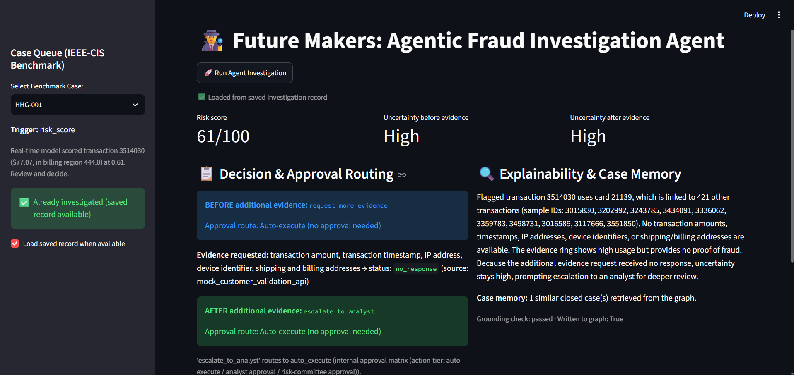
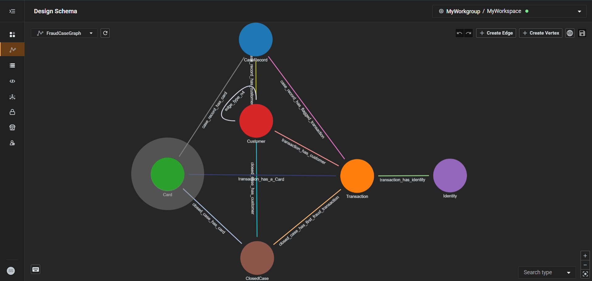

# Future Makers - Agentic Fraud Investigation Agent

An open-source AI agent for the **TigerGraph Agentic Fraud Investigation** hackathon (Hacker House Goa, Task 4). It investigates fraud cases end-to-end: it gathers evidence from a TigerGraph knowledge graph, assesses risk and uncertainty, requests additional evidence when needed, recommends the next-best action with the right approval route, and writes its findings back to the graph as case memory.

> **Status:** hackathon prototype, being turned into a maintained open-source project. See the [Roadmap](#roadmap).

**Demo video:** [Watch the demo on Google Drive](https://drive.google.com/file/d/1uHBBthtNJ89C2yrlq05yksiq-x7Etro0/view?usp=sharing)

## Why this project

Many fraud-detection examples stop at a risk score. This project shows the full investigation workflow: evidence gathering over a graph, uncertainty tracking before and after extra evidence, policy-based approval routing, explainable decisions, and Suspicious Activity Report (SAR) generation. Every case is written back to the graph so future investigations can learn from it.

## Screenshots

**Streamlit dashboard: benchmark case HHG-001.** Shows the risk score, uncertainty before and after evidence, the decision before and after the additional evidence request, approval routing, and the explainability and case memory panel.



**TigerGraph schema (`FraudCaseGraph`).** Vertices: `CaseRecord`, `Customer`, `Card`, `Transaction`, `Identity`, and `ClosedCase`, connected by edges such as `transaction_has_a_Card`, `transaction_has_identity`, and `case_record_has_flagged_transaction`.



## Architecture

- **Intelligence engine:** Groq API (`openai/gpt-oss-120b`), used for reasoning, evidence synthesis, and generating explanations
- **Agent framework:** custom Python implementation (no external agent framework), with direct API calls and orchestration logic in `agent.py`
- **Graph database:** TigerGraph Cloud (Savanna), storing transactions, accounts, devices, identities, and case records; graph traversal and relationship analysis via GSQL
- **Interface:** Streamlit dashboard (`app.py`) with a case queue, risk score, uncertainty before/after evidence, decision and approval routing, and an explainability panel
- **Output:** case records and Suspicious Activity Reports (SARs) in JSON, written to both local files and the graph

## How it works

1. **Trigger:** an investigation starts from a risk score, customer report, or analyst request
2. **Investigate:** the agent opens or creates a case and gathers evidence from the graph (transaction history, connected accounts, device signals, prior cases)
3. **Assess:** it determines the fraud pattern, risk level, and confidence
4. **Request more evidence** if uncertainty is too high (for example step-up authentication or customer validation)
5. **Recommend next action:** allow, block, monitor, or escalate, routed for approval per policy
6. **Explain:** it documents the evidence used and the reasoning behind the decision
7. **Update case memory:** it writes the case back to the graph so future investigations can learn from it

## Example output

Each benchmark case produces a JSON file in `answers/`. A summary of selected cases:

| Case | Risk score | Uncertainty before / after evidence | Decision before evidence | Decision after evidence | Approval route |
|------|------------|-------------------------------------|--------------------------|-------------------------|----------------|
| HHG-001 | 61/100 | High / High | request_more_evidence | escalate_to_analyst | Auto-execute |
| [case_Y] | [value] | [value] | [decision] | [decision] | [route] |
| [case_Z] | [value] | [value] | [decision] | [decision] | [route] |

In HHG-001 the additional evidence request received no response from the mock customer validation API, so uncertainty stayed high and the agent escalated the case to an analyst.

<!-- Replace [case_Y] and [case_Z] with 2 more real results from your answers/ folder, ideally one where uncertainty drops after evidence. -->

## Project structure

```
app.py                      # Streamlit UI
agent.py                    # Core agent logic
case_manager.py             # Case creation and progression
common.py                   # Shared utilities
diagnose_graph_write.py     # Graph write diagnostics
run_demo_cases.py           # Runs the benchmark cases
case_pack.csv               # Benchmark case triggers
identity.csv                # Device / identity signals
closed_cases_history.csv    # Prior closed cases (case memory source)
sar_reports_final.json      # Generated SAR reports
transactions_pruned.csv     # Transaction dataset (see Dataset)
answers/                    # One JSON answer file per benchmark case
    case_1.json ... case_20.json
```

Each file in `answers/` contains, per case: the internal investigation record (evidence, findings, decisions, actions), a Suspicious Activity Report when required by policy, and the next-best-action with its required approval route, recorded both before and after any additional evidence was requested.

## Setup

**Prerequisites**

- Python 3.10+
- A TigerGraph Cloud (Savanna) workspace: https://tgcloud.io
- A Groq API key: https://console.groq.com

**Install**

```bash
git clone https://github.com/Kaushik-20281/tigergraph-fraud-agent.git
cd tigergraph-fraud-agent
pip install -r requirements.txt
```

**Configure**

Create a `.env` file in the project root with:

```
PROD_TG_HOST=your_tigergraph_host
PROD_TG_SECRET=your_tigergraph_secret
GROQ_API_KEY=your_groq_api_key
```

`.env` is excluded from version control via `.gitignore`. Never commit real credentials.

**Load the data**

1. Create a graph in your TigerGraph workspace and load the schema and data for transactions, accounts, devices, identities, and cases.
2. Place `transactions_pruned.csv` in the project root (see [Dataset](#dataset) for where the data comes from).
3. Run `python diagnose_graph_write.py` to confirm the agent can write case records back to the graph.

<!-- If you have a schema/loading script or GSQL file, add its name and command to step 1 above. -->

## Run

```bash
streamlit run app.py
```

Open the app at `http://localhost:8501` and select a benchmark case from the Case Queue to view its investigation, evidence, risk assessment, decision routing, and explainability.

To run the benchmark cases from the command line:

```bash
python run_demo_cases.py
```

## Dataset

Built on the [IEEE-CIS Fraud Detection dataset](https://www.kaggle.com/c/ieee-fraud-detection) (Vesta Corporation), extended with the bank's fraud policy, known fraud patterns, and 20 benchmark cases used for evaluation. The dataset is third-party data; please follow its original terms of use.

## Roadmap

- [ ] Unit tests for `agent.py` and `case_manager.py`
- [ ] One-command setup script for the TigerGraph schema and data
- [ ] Refactor `agent.py` into smaller, testable modules
- [ ] Documented evaluation on the 20 benchmark cases
- [ ] Support for more fraud patterns and additional datasets
- [ ] Improved dashboard and explainability panel

## Contributing

Issues and pull requests are welcome. If you find a bug or have an idea, please open an issue first to discuss it.

## License

MIT License. See the `LICENSE` file.

## Team

Future Makers: Kaushik S, Nishan M, Muthu Karthigai Selvam S (VSB Engineering College)
